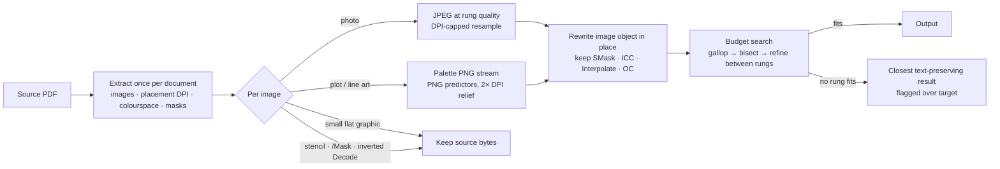

<div align="center">

# PaperSqueeze 📄🗜️

[](https://github.com/asimfish/pdf-image-compressor/actions/workflows/ci.yml)
[](https://github.com/asimfish/pdf-image-compressor/releases)
[](pyproject.toml)
[](LICENSE)
[](https://liyufeng854--papersqueeze-serve.modal.run)

**English** | [中文](README_CN.md)

> 🎯 **Squeeze a paper PDF down to any target size — without killing the text.**
> PaperSqueeze re-encodes only the images that actually take up space, picks the
> right codec for each one, and keeps searchable text, formulas, hyperlinks,
> vector graphics, transparency and colour profiles intact.

[**Try the live demo →**](https://liyufeng854--papersqueeze-serve.modal.run) *(free instance, may need a cold start)*

</div>

---

## Contents

1. [Why PaperSqueeze](#1-why-papersqueeze)
2. [Quick Start](#2--quick-start)
3. [Features](#3--features)
4. [Benchmark](#4--benchmark)
5. [Compression Modes](#5--compression-modes)
6. [How It Works](#6--how-it-works)
7. [What Is Preserved](#7--what-is-preserved)
8. [Limitations & Non-Goals](#8--limitations--non-goals)
9. [CLI Usage](#9--cli-usage)
10. [Web UI](#10--web-ui)
11. [Deployment](#11--deployment)
12. [Configuration](#12--configuration)
13. [API](#13--api)
14. [Testing & Development](#14--testing--development)
15. [Contributing](#15--contributing)
16. [Citation](#16--citation)
17. [Star History](#17--star-history)
18. [License](#18-license)

---

## 1. Why PaperSqueeze

Most PDF compressors hit a size target by rasterizing whole pages — your paper
becomes a stack of screenshots: no text selection, no search, dead links, blurry
formulas. Submission portals don't care; your readers do.

PaperSqueeze takes the opposite approach:

- **Only images are re-encoded.** Text, fonts, vector figures and link
  annotations pass through untouched — their SHA-256 fingerprints are identical
  before and after.
- **Each image gets the codec it deserves.** Photographs become JPEG at the
  highest quality the budget allows; plots and line art become palette PNG
  streams (JPEG would smear their strokes); small flat-colour graphics are left
  in their lossless source encoding.
- **Bytes are recovered where nobody can see them.** A 4000-pixel figure printed
  two inches wide is 2000 DPI; capping it at 300 DPI is invisible and frees more
  budget than any quality slider. Icons drawn at native size keep every pixel.
- **The output renders everywhere.** Files are verified against MuPDF,
  Ghostscript and macOS Quartz (Preview). Soft masks, ICC colour profiles,
  rendering hints, optional-content groups and structure tags are kept.
- **Rasterization is never silent.** If the budget cannot be met while keeping
  the text layer, you get the closest faithful result, clearly flagged. Only
  the explicit `raster` mode trades away text.

## 2. 🚀 Quick Start

Requires Python 3.10+ and [uv](https://docs.astral.sh/uv/).

```bash
# 1. Install
git clone https://github.com/asimfish/pdf-image-compressor.git
cd pdf-image-compressor
uv sync --locked --extra dev

# 2. Compress to a target size (default fidelity mode — never rasterizes)
uv run file-compressor compress paper.pdf --target-size 3MB

# 3. Or use the browser UI
uv run file-compressor web        # → http://127.0.0.1:8765
```

No install at all? Use the [live demo](https://liyufeng854--papersqueeze-serve.modal.run)
or run the published container:

```bash
docker run --rm -p 8080:8080 -e PDF_COMPRESSOR_PUBLIC_MODE=1 \
  ghcr.io/asimfish/pdf-image-compressor:latest   # → http://127.0.0.1:8080
```

## 3. ✨ Features

- 🎯 **Target-size compression** — give it `500KB`, `3MB`, `10MiB` or a byte
  count; a galloping bisection over a quality ladder, followed by refinement
  between rungs, lands within about 1% of the budget in 6–9 encodes.
- 🔤 **Text-first** — searchable text, copy/paste and hyperlinks survive in every
  mode except the explicit `raster` mode.
- 🧠 **Content-aware codecs** — photos → JPEG; plots, diagrams and line art →
  palette PNG streams with PNG predictors; small flat-colour graphics → kept
  lossless.
- 📐 **Placement-aware resolution** — images are downscaled only when their
  effective DPI on the page exceeds the rung's cap; nothing is resampled by
  less than 15% and nothing shown at native size is touched.
- 🎨 **Colour-faithful** — ICC colourspaces (e.g. Display P3 scans) are kept;
  CMYK is converted through MuPDF's ICC-aware pipeline, measured closest to
  Quartz, Ghostscript and MuPDF renderings of the original.
- 🪟 **Transparency-faithful** — external soft masks stay attached (partial
  alpha, shared masks, indirect subtypes, `Matte`); stencil masks, colour-key
  masks and inverted `Decode` arrays are recognised and left alone.
- 🖨️ **Renderer-safe output** — images are rewritten in place: no `null`
  placeholders that make Ghostscript drop a page, no lost `/Interpolate`,
  `/Intent`, `/OC` or `/StructParent`.
- ⚡ **Fast** — every image is extracted once per document and re-encoded on a
  thread pool for each ladder rung: a 251-page scanned book to 8 MiB in 34 s.
- 🎚️ **Four intensity levels** for budget-free compression — 1 near-lossless,
  2 balanced, 3 aggressive, 4 maximum.
- 🖥️ **CLI + Web UI** — single files, directory batches, JSON reports, or a
  browser workflow; standalone images (JPEG/PNG/WebP) are supported too.
- 🌐 **Two site modes** — a persistent local PDF library, or an anonymous
  stateless public site with automatic temp-file cleanup and an optional
  password gate.
- 📦 **Verified container** — every `main` push is built, smoke-tested and
  published to GitHub Container Registry; releases get versioned tags.

## 4. 📊 Benchmark

Eight real documents — handwritten notes, arXiv and Nature papers, a CMYK
conference handbook, a 251-page scanned textbook, a slide deck — compressed by
PaperSqueeze and by [PixShift](https://github.com/ChangWinde/pixshift) 2.0 to the
**same byte budget**, scored with the tool-neutral
[`scripts/compare_pdf_quality.py`](scripts/compare_pdf_quality.py).

| Document | Budget | PaperSqueeze | PixShift |
| --- | --- | --- | --- |
| Handwritten notes (P3, 27.5 MB) | 10 MiB | 100.0% · SSIM 0.9910 · 5 s | 98.1% · SSIM 0.9915 · 52 s |
| CycleGAN paper (650 images, 37.6 MB) | 8 MiB | 99.1% · SSIM **0.9985** · 8 s | 99.9% · SSIM 0.9941 · 270 s |
| arXiv paper (28.9 MB) | 6 MiB | 99.7% · SSIM 0.9775 · 15 s | failed · 208 s |
| Nature paper (10.4 MB) | 3 MiB | 99.5% · SSIM 0.9998 · 3 s | 100.0% · SSIM 0.9998 · 33 s |
| Conference handbook (CMYK, 26.6 MB) | 8 MiB | over budget* · SSIM 0.9979 · 39 s | failed · 1468 s |
| Scanned textbook (251 pages, 18.4 MB) | 8 MiB | 99.2% · SSIM 0.9813 · 34 s | failed · 1144 s |
| Slide deck (5.6 MB) | 2 MiB | over budget* · SSIM 0.9821 · 5 s | failed · 101 s |
| CVPR paper (10.0 MB) | 3 MiB | 98.4% · SSIM 0.9997 · 3 s | failed · 82 s |

**Budget met 6/8 vs 3/8 · total time 111 s vs 3,356 s · text, links and soft
masks identical to the source in all eight outputs.** Percentages are output
size relative to the budget; SSIM is the page mean at 96 DPI.
`*` vector text and fonts alone exceed the budget — unreachable without
rasterizing; the closest faithful result is returned and flagged.

Full setup, corpus description, per-page worst cases, metric caveats and
reproduction instructions: [docs/BENCHMARK.md](docs/BENCHMARK.md)
([中文](docs/BENCHMARK_CN.md)). Run it on your own corpus:

```bash
uv run scripts/benchmark_corpus.py --manifest corpus.json --out bench/ --pixshift
```

## 5. 🧭 Compression Modes

| Mode | Text layer | Behaviour |
| --- | --- | --- |
| `fidelity` *(default)* | ✅ kept | Quality-first. Lossless optimization, then near-lossless image re-encoding (q95/q92) at native resolution. With `--target-size` the budget is a hard constraint: the quality ladder is walked from q95 down and the highest quality that fits is returned, downscaling only once no native-resolution quality fits |
| `auto` | ✅ kept | Same search starting at q92; balanced defaults without a target |
| `text` | ✅ kept | Keep-text image re-encoding driven by `--compression-level` |
| `optimize` | ✅ kept | Lossless structural optimization only |
| `raster` | ❌ lost | Rasterizes pages at `--pdf-dpi` — the only mode that trades away text; never chosen implicitly |

When even the lowest rung misses the budget, `fidelity`, `auto` and `text`
return the highest-quality rung within 10% of the smallest achievable size
(there is no point crushing images for a few percent once vectors and fonts
dominate) and the CLI reports `OK (over target)`.

## 6. 🔬 How It Works



1. **Extract once.** Every image is pulled out a single time together with its
   placement (largest drawn size → effective DPI), colourspace family, soft
   mask, `Decode` and mask entries. Images whose semantics would not survive a
   swap (stencil masks, colour-key masks, inverted DCT streams) are skipped.
2. **Choose a codec per image.** Photos are JPEG. Images that are mostly one
   background colour with thin anti-aliased strokes are palette PNG: on
   vector-field figures a 0.5× palette PNG scored SSIM 0.98 at 673 KB where JPEG
   needed 1.1 MB for 0.90. Small images with ≤ 256 colours stay lossless.
3. **Walk a quality ladder.** Rungs lower JPEG quality first at native
   resolution (q92 → q70), then add placement-aware DPI caps (300 → 72 DPI).
   A galloping bisection finds the first rung that fits; refinement then lowers
   quality at the higher rung's resolution and only resamples when no
   native-resolution quality fits. Every accepted candidate is verified against
   the budget, so the result never overshoots.
4. **Rewrite in place.** Only the sample stream and its format keys change;
   `/SMask`, `/Interpolate`, `/Intent`, `/OC`, `/StructParent` and a still-valid
   ICC `/ColorSpace` are untouched. A partially rewritten object aborts the run
   rather than saving a corrupt file.

## 7. 🛡️ What Is Preserved

| Property | Guarantee |
| --- | --- |
| Text, fonts, formulas | untouched — text fingerprint identical |
| Hyperlinks and annotations | untouched — link fingerprint identical |
| Vector graphics | untouched |
| Page count, size, rotation | unchanged (verified by the benchmark script) |
| Soft masks (`/SMask`) | kept attached, including `Matte`, shared and indirect masks |
| ICC colourspaces (`/ICCBased`, `/CalRGB`, `/CalGray`) | kept when the component count is unchanged (e.g. Display P3 scans stay P3) |
| Indexed, Separation, DeviceN, Lab images | never re-attached to a mismatched colourspace |
| Stencil masks, colour-key masks, inverted `Decode` | left in their original encoding |
| `/Interpolate`, `/Intent`, `/OC`, `/StructParent` | kept |
| CMYK images | converted to RGB through MuPDF's ICC-aware pipeline (see limitations) |

Outputs are checked page by page against the source in **MuPDF**,
**Ghostscript 10** and **macOS Quartz** (Preview) — see
[docs/BENCHMARK.md](docs/BENCHMARK.md#rendering-compatibility).

## 8. ⚠️ Limitations & Non-Goals

- **Budgets below the vector floor are unreachable.** When fonts, outlined text
  or vector art alone exceed the target, no image re-encoding can reach it.
  PaperSqueeze returns the closest faithful result and flags it; use `raster`
  explicitly if you really need the bytes.
- **CMYK becomes RGB.** Keeping CMYK JPEGs costs ~2.4× the bytes; the conversion
  runs through MuPDF (ICC-aware) rather than Pillow's naive formula, but print
  workflows that need DeviceCMYK should not use this tool.
- **JPEG 2000 and other exotic image codecs are re-encoded** to JPEG or PNG.
- **Inline images** (`BI … EI` inside content streams) and images inside
  patterns are not touched.
- **Not a PDF/A or PDF/X validator.** Structure and metadata are preserved, but
  conformance is not asserted.
- **SSIM is a proxy.** Worst pages on noise-like textures or 33 KB scanned pages
  score below 0.9 at high compression ratios; inspect the output when the ratio
  exceeds ~4×.

## 9. ⌨️ CLI Usage

```bash
# Default: fidelity-first, no rasterization, honor a 3 MB budget
uv run file-compressor compress input.pdf --target-size 3MB

# Same search starting one rung lower (q92)
uv run file-compressor compress input.pdf --target-size 3MB --pdf-mode auto

# Keep text, drive image re-encoding by level instead of budget
uv run file-compressor compress input.pdf --pdf-mode text --compression-level 3

# Extreme compression — loses the text layer (explicit opt-in)
uv run file-compressor compress input.pdf --target-size 800KB \
  --pdf-mode raster --pdf-dpi 120

# Batch a directory with a JSON report
uv run file-compressor compress ./papers --output-dir ./compressed --json-report
```

`--target-size` accepts `500KB`, `2MB`, `1.5GB` (decimal) or a plain byte
count such as `10485760`. Other useful flags: `--compression-level 1..4`,
`--pdf-grayscale`, `--keep-metadata`, `--to-webp` (images), `--archive zip`.

## 10. 🖥️ Web UI

**Local library mode** (persistent):

```bash
uv run file-compressor web                          # → http://127.0.0.1:8765
uv run file-compressor web --data-dir /path/to/lib  # custom library location
```

PDFs, notes and compression versions are stored in `~/.pdf-manager`. This mode
has no authentication — bind it to localhost or a trusted network only.

**Public stateless mode** (anonymous): exposes only the landing page, config,
health check and single-file compression; every upload is processed in an
isolated temp directory and deleted after the response. Restrictive security
headers are applied and OpenAPI docs are disabled.

```bash
PDF_COMPRESSOR_PUBLIC_MODE=1 uv run file-compressor web --host 0.0.0.0 --port 8080
```

See [Configuration](#12--configuration) for limits, timeouts, rate limiting and
the optional password gate. A commented [`.env.example`](.env.example) is included.

## 11. ☁️ Deployment

```bash
docker run --rm -p 8080:8080 -e PDF_COMPRESSOR_PUBLIC_MODE=1 \
  ghcr.io/asimfish/pdf-image-compressor:latest
```

Step-by-step guides for **Docker / Modal (free tier) / Hugging Face Spaces /
Google Cloud Run** live in [docs/DEPLOYMENT.md](docs/DEPLOYMENT.md)
([中文](docs/DEPLOYMENT_CN.md)). The image is platform-neutral OCI — it runs
anywhere containers do.

## 12. ⚙️ Configuration

| Variable | Default | Description |
| --- | --- | --- |
| `PDF_COMPRESSOR_PUBLIC_MODE` | off | Set `1` to enable the anonymous stateless public site |
| `PDF_COMPRESSOR_ACCESS_PASSWORD` | unset | Optional public-mode password gate; visitors authenticate once per browser for 30 days |
| `PDF_COMPRESSOR_MAX_UPLOAD_MB` | 30 public / 500 library | Per-file upload cap (1–500 MiB) |
| `PDF_COMPRESSOR_MAX_PAGES` | 100 | Public-mode page cap (1–2000) |
| `PDF_COMPRESSOR_UPLOAD_TIMEOUT_SECONDS` | 120 | Public-mode total upload window (10–900 s) |
| `PDF_COMPRESSOR_PROCESSING_TIMEOUT_SECONDS` | 300 | Public-mode compression cap (30–1800 s); the isolated worker is killed on timeout |
| `PDF_COMPRESSOR_DOWNLOAD_TIMEOUT_SECONDS` | 120 | Public-mode download window (10–900 s); temp files are cleaned on timeout |
| `PDF_COMPRESSOR_RATE_LIMIT_PER_MINUTE` | 12 | Compression requests accepted per instance per minute (1–120) |
| `PDF_COMPRESSOR_CONCURRENCY` | 1 | Concurrent compression jobs per instance (1–4) |
| `PORT` | 8080 | Container listen port |

## 13. 🔌 API

Public mode:

- `GET /` — compression page
- `GET /api/health` — health check
- `GET /api/config` — upload limits for the frontend
- `POST /compress` — upload one PDF, receive the compressed PDF

Local library mode additionally provides `/api/pdfs`, `/api/versions`, batch
compression/deletion, page previews, notes and version downloads. In dev mode
the full OpenAPI schema is at `/docs`.

## 14. 🧪 Testing & Development

```bash
uv sync --locked --extra dev
uv run ruff check src tests scripts deploy_huggingface_space.py deploy_modal.py
uv run pip-audit --local --skip-editable
uv run python -m pytest -q
uv build
```

The suite has **477 tests** covering the CLI, PDF and image compression, target
search (ladder, refinement, unreachable budgets), codec selection (flat and
graphic detection, palette PNG streams, CMYK), colourspace and dictionary
preservation (ICC, Indexed, soft masks, `Interpolate`/`Intent`, no `null`
entries), thread-pool determinism, the visual-quality benchmark tooling, the
web API, deployment packaging, storage and error handling. CI runs Ruff,
dependency audits and the tests on Python 3.10 and 3.12, then builds the
distribution and verifies the container.

## 15. 🤝 Contributing

Issues and pull requests are welcome — see [CONTRIBUTING.md](CONTRIBUTING.md).
Changes to compression behaviour must report sizes, text/link/soft-mask
preservation, at least one visual metric (SSIM/PSNR), runtime and peak memory,
and include a regression test. Report vulnerabilities privately via
[SECURITY.md](SECURITY.md).

Ideas on the roadmap: per-image byte allocation instead of a document-wide
quality rung, mozjpeg/JPEG XL encoders, an opt-in DeviceCMYK-preserving path,
and an emergency fallback that JPEG-encodes line art when it is the only way to
meet a budget.

## 16. 📖 Citation

If PaperSqueeze helps your work, please cite it (see [CITATION.cff](CITATION.cff)):

```bibtex
@software{papersqueeze,
  author  = {Li, Yufeng},
  title   = {PaperSqueeze: target-aware PDF compression that preserves searchable text, links, and vector content},
  year    = {2026},
  url     = {https://github.com/asimfish/pdf-image-compressor}
}
```

## 17. ⭐ Star History

[](https://star-history.com/#asimfish/pdf-image-compressor&Date)

## 18. License

[MIT](LICENSE)
