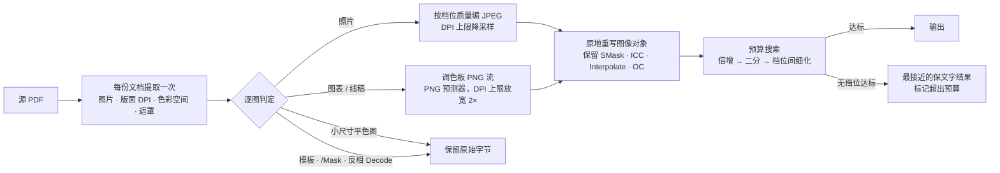

<div align="center">

# PaperSqueeze 📄🗜️

[](https://github.com/asimfish/pdf-image-compressor/actions/workflows/ci.yml)
[](https://github.com/asimfish/pdf-image-compressor/releases)
[](pyproject.toml)
[](LICENSE)
[](https://liyufeng854--papersqueeze-serve.modal.run)

[English](README.md) | **中文**

> 🎯 **把论文 PDF 压到任意目标大小——而不牺牲文字。**
> PaperSqueeze 只重新编码真正占空间的图片，为每张图选择合适的编码器，
> 并完整保留可搜索文字、公式、超链接、矢量图形、透明层和色彩配置文件。

[**在线体验 →**](https://liyufeng854--papersqueeze-serve.modal.run) *（免费实例，首次访问可能需要冷启动）*

</div>

---

## 目录

1. [为什么选 PaperSqueeze](#1-为什么选-papersqueeze)
2. [快速开始](#2--快速开始)
3. [特性](#3--特性)
4. [基准对比](#4--基准对比)
5. [压缩模式](#5--压缩模式)
6. [工作原理](#6--工作原理)
7. [保真保证](#7--保真保证)
8. [局限与非目标](#8--局限与非目标)
9. [命令行用法](#9--命令行用法)
10. [Web 界面](#10--web-界面)
11. [部署](#11--部署)
12. [配置项](#12--配置项)
13. [API](#13--api)
14. [测试与开发](#14--测试与开发)
15. [参与贡献](#15--参与贡献)
16. [引用](#16--引用)
17. [Star 趋势](#17--star-趋势)
18. [许可证](#18-许可证)

---

## 1. 为什么选 PaperSqueeze

大多数 PDF 压缩器靠整页栅格化来达到目标大小——论文变成一叠截图：不能选中文字、不能搜索、链接失效、公式发糊。投稿系统不在意，读者在意。

PaperSqueeze 走相反的路线：

- **只重编码图片。**文字、字体、矢量插图和链接注释原样通过——压缩前后的 SHA-256 指纹完全一致。
- **每张图用合适的编码器。**照片在预算允许的最高质量下编为 JPEG；图表和线稿编为调色板 PNG 流（JPEG 会把细线糊掉）；小尺寸平色图保持无损原编码。
- **从看不见的地方回收字节。**一张 4000 像素、打印宽度两英寸的插图是 2000 DPI；压到 300 DPI 肉眼不可见，却比任何质量滑块省得更多。按原生尺寸显示的图标一个像素都不动。
- **输出在哪都能正常渲染。**文件经 MuPDF、Ghostscript 和 macOS Quartz（预览）逐页验证。软遮罩、ICC 色彩配置文件、渲染提示、可选内容组和结构标签全部保留。
- **绝不悄悄栅格化。**若保留文字层达不到预算，你会得到最接近的忠实结果并被明确提示。只有显式的 `raster` 模式才会放弃文字。

## 2. 🚀 快速开始

需要 Python 3.10+ 和 [uv](https://docs.astral.sh/uv/)。

```bash
# 1. 安装
git clone https://github.com/asimfish/pdf-image-compressor.git
cd pdf-image-compressor
uv sync --locked --extra dev

# 2. 压缩到目标大小（默认 fidelity 模式——绝不栅格化）
uv run file-compressor compress paper.pdf --target-size 3MB

# 3. 或使用浏览器界面
uv run file-compressor web        # → http://127.0.0.1:8765
```

不想安装？使用[在线演示](https://liyufeng854--papersqueeze-serve.modal.run)，或运行已发布的容器：

```bash
docker run --rm -p 8080:8080 -e PDF_COMPRESSOR_PUBLIC_MODE=1 \
  ghcr.io/asimfish/pdf-image-compressor:latest   # → http://127.0.0.1:8080
```

## 3. ✨ 特性

- 🎯 **目标大小压缩**——输入 `500KB`、`3MB`、`10MiB` 或字节数；在质量阶梯上做倍增二分、再在相邻档位间细化，6–9 次编码内落在预算的约 1% 以内。
- 🔤 **文字优先**——除显式 `raster` 模式外，所有模式都保留可搜索文字、复制粘贴和超链接。
- 🧠 **内容感知编码**——照片 → JPEG；图表、示意图、线稿 → 带 PNG 预测器的调色板 PNG 流；小尺寸平色图 → 保持无损。
- 📐 **按版面分辩率缩放**——只有图片在页面上的有效 DPI 超过该档上限时才降采样；缩放幅度不足 15% 不重采样，按原生尺寸显示的图片不动。
- 🎨 **色彩忠实**——保留 ICC 色彩空间（如 Display P3 扫描件）；CMYK 经 MuPDF 的 ICC 管线转换，实测最接近 Quartz、Ghostscript 和 MuPDF 对原件的渲染。
- 🪟 **透明层忠实**——外部软遮罩保持挂接（半透明、共享遮罩、间接子类型、`Matte`）；模板遮罩、色键遮罩和反相 `Decode` 数组会被识别并原样保留。
- 🖨️ **渲染器安全的输出**——图像对象原地重写：不会残留让 Ghostscript 丢掉整页的 `null` 占位符，不会丢失 `/Interpolate`、`/Intent`、`/OC`、`/StructParent`。
- ⚡ **快**——每份文档的图片只提取一次，各质量档在线程池上重编码：251 页扫描书压到 8 MiB 用时 34 秒。
- 🎚️ **四档压缩强度**（无预算时）——1 近无损、2 均衡、3 激进、4 最大。
- 🖥️ **CLI + Web UI**——单文件、目录批量、JSON 报告或浏览器操作；也支持独立图片（JPEG/PNG/WebP）。
- 🌐 **两种站点模式**——本地持久化 PDF 资料库，或匿名无状态公开站点（自动清理临时文件，可选密码门）。
- 📦 **经验证的容器**——每次推送 `main` 都会构建、冒烟测试并发布到 GitHub Container Registry；正式版本带版本标签。

## 4. 📊 基准对比

八份真实文档——手写笔记、arXiv 与 Nature 论文、CMYK 会议手册、251 页扫描教材、答辩幻灯片——由 PaperSqueeze 和 [PixShift](https://github.com/ChangWinde/pixshift) 2.0 压缩到**完全相同的字节预算**，用工具无关的 [`scripts/compare_pdf_quality.py`](scripts/compare_pdf_quality.py) 评分。

| 文档 | 预算 | PaperSqueeze | PixShift |
| --- | --- | --- | --- |
| 手写笔记（P3，27.5 MB） | 10 MiB | 100.0% · SSIM 0.9910 · 5 s | 98.1% · SSIM 0.9915 · 52 s |
| CycleGAN 论文（650 图，37.6 MB） | 8 MiB | 99.1% · SSIM **0.9985** · 8 s | 99.9% · SSIM 0.9941 · 270 s |
| arXiv 论文（28.9 MB） | 6 MiB | 99.7% · SSIM 0.9775 · 15 s | 失败 · 208 s |
| Nature 论文（10.4 MB） | 3 MiB | 99.5% · SSIM 0.9998 · 3 s | 100.0% · SSIM 0.9998 · 33 s |
| 会议手册（CMYK，26.6 MB） | 8 MiB | 超出预算* · SSIM 0.9979 · 39 s | 失败 · 1468 s |
| 扫描教材（251 页，18.4 MB） | 8 MiB | 99.2% · SSIM 0.9813 · 34 s | 失败 · 1144 s |
| 答辩幻灯片（5.6 MB） | 2 MiB | 超出预算* · SSIM 0.9821 · 5 s | 失败 · 101 s |
| CVPR 论文（10.0 MB） | 3 MiB | 98.4% · SSIM 0.9997 · 3 s | 失败 · 82 s |

**预算达标 6/8 vs 3/8 · 总耗时 111 s vs 3,356 s · 八份输出的文字、链接、软遮罩全部与源文件一致。**百分比为输出大小相对预算的比例；SSIM 为 96 DPI 下的页面均值。`*` 矢量文字和字体本身已超过预算——不栅格化就不可达；返回最接近的忠实结果并给出提示。

完整环境、语料说明、逐页最差情况、度量局限与复现步骤见 [docs/BENCHMARK_CN.md](docs/BENCHMARK_CN.md)（[English](docs/BENCHMARK.md)）。在你自己的语料上运行：

```bash
uv run scripts/benchmark_corpus.py --manifest corpus.json --out bench/ --pixshift
```

## 5. 🧭 压缩模式

| 模式 | 文字层 | 行为 |
| --- | --- | --- |
| `fidelity`*（默认）* | ✅ 保留 | 质量优先。先无损优化，再在原生分辩率做近无损重编码（q95/q92）。指定 `--target-size` 时预算是硬约束：从 q95 起向下走质量阶梯，返回能塞进预算的最高质量；只有原生分辩率下没有任何质量档能达标时才降采样 |
| `auto` | ✅ 保留 | 同一套搜索，从 q92 起；无目标时使用均衡默认值 |
| `text` | ✅ 保留 | 由 `--compression-level` 驱动的保文字重编码 |
| `optimize` | ✅ 保留 | 仅做无损结构优化 |
| `raster` | ❌ 丢失 | 按 `--pdf-dpi` 栅格化页面——唯一放弃文字层的模式，绝不会被隐式选中 |

当连最低档也达不到预算时，`fidelity`、`auto` 和 `text` 返回与最小可达大小相差 10% 以内、质量最高的一档（矢量和字体占大头时，再把图片压烂换几个百分点毫无意义），CLI 提示 `OK (over target)`。

## 6. 🔬 工作原理



1. **只提取一次。**每张图连同其版面信息（最大绘制尺寸 → 有效 DPI）、色彩空间族、软遮罩、`Decode` 与遮罩项一次性取出。语义无法在替换后存活的图（模板遮罩、色键遮罩、反相的 DCT 流）直接跳过。
2. **逐图选编码器。**照片用 JPEG。以单一背景色为主、带细抗锯齿笔画的图用调色板 PNG：在矢量场插图上，0.5× 的调色板 PNG 以 673 KB 达到 SSIM 0.98，而 JPEG 要 1.1 MB 才到 0.90。≤ 256 色的小图保持无损。
3. **走质量阶梯。**各档先在原生分辩率降 JPEG 质量（q92 → q70），再加上按版面计算的 DPI 上限（300 → 72 DPI）。倍增二分找到首个达标档；细化阶段先在更高档的分辩率上降质量，只有原生分辩率下没有任何质量能达标时才重采样。每个被接受的候选都经过预算校验，结果绝不超标。
4. **原地重写。**只改采样流和描述格式的键；`/SMask`、`/Interpolate`、`/Intent`、`/OC`、`/StructParent` 以及仍然有效的 ICC `/ColorSpace` 一律不动。对象若只写了一半就中止运行，而不是保存一个损坏的文件。

## 7. 🛡️ 保真保证

| 属性 | 保证 |
| --- | --- |
| 文字、字体、公式 | 不动——文字指纹一致 |
| 超链接与注释 | 不动——链接指纹一致 |
| 矢量图形 | 不动 |
| 页数、页面尺寸、旋转 | 不变（由基准脚本校验） |
| 软遮罩（`/SMask`） | 保持挂接，含 `Matte`、共享与间接遮罩 |
| ICC 色彩空间（`/ICCBased`、`/CalRGB`、`/CalGray`） | 分量数不变时保留（如 Display P3 扫描件仍是 P3） |
| Indexed、Separation、DeviceN、Lab 图像 | 绝不回挂到不匹配的色彩空间 |
| 模板遮罩、色键遮罩、反相 `Decode` | 保持原始编码 |
| `/Interpolate`、`/Intent`、`/OC`、`/StructParent` | 保留 |
| CMYK 图像 | 经 MuPDF 的 ICC 管线转为 RGB（见局限） |

输出在 **MuPDF**、**Ghostscript 10** 和 **macOS Quartz**（预览）中逐页与源文件比对——见 [docs/BENCHMARK_CN.md](docs/BENCHMARK_CN.md#渲染兼容性)。

## 8. ⚠️ 局限与非目标

- **低于矢量下限的预算不可达。**当字体、轮廓化文字或矢量图本身就超过目标时，任何图片重编码都无济于事。PaperSqueeze 返回最接近的忠实结果并提示；真的需要那些字节时请显式使用 `raster`。
- **CMYK 会变成 RGB。**保留 CMYK JPEG 要多付约 2.4 倍字节；转换走 MuPDF（ICC 感知）而非 Pillow 的朴素公式，但需要 DeviceCMYK 的印刷流程不应使用本工具。
- **JPEG 2000 等特殊图像编码会被重编码**为 JPEG 或 PNG。
- **内联图像**（内容流中的 `BI … EI`）和图案内的图像不处理。
- **不是 PDF/A 或 PDF/X 校验器。**结构和元数据会保留，但不断言合规性。
- **SSIM 只是代理指标。**在高压缩比下，类噪声纹理或每页 33 KB 的扫描页最差分低于 0.9；压缩比超过约 4× 时请检查输出。

## 9. ⌨️ 命令行用法

```bash
# 默认：质量优先、不栅格化、遵守 3 MB 预算
uv run file-compressor compress input.pdf --target-size 3MB

# 同一套搜索，从低一档（q92）起步
uv run file-compressor compress input.pdf --target-size 3MB --pdf-mode auto

# 保留文字，按强度而非预算驱动图片重编码
uv run file-compressor compress input.pdf --pdf-mode text --compression-level 3

# 极限压缩——丢失文字层（需显式选择）
uv run file-compressor compress input.pdf --target-size 800KB \
  --pdf-mode raster --pdf-dpi 120

# 批量处理目录并输出 JSON 报告
uv run file-compressor compress ./papers --output-dir ./compressed --json-report
```

`--target-size` 支持 `500KB`、`2MB`、`1.5GB`（十进制）或纯字节数如 `10485760`。其他常用参数：`--compression-level 1..4`、`--pdf-grayscale`、`--keep-metadata`、`--to-webp`（图片）、`--archive zip`。

## 10. 🖥️ Web 界面

**本地资料库模式**（持久化）：

```bash
uv run file-compressor web                          # → http://127.0.0.1:8765
uv run file-compressor web --data-dir /path/to/lib  # 自定义资料库位置
```

PDF、备注和压缩版本保存在 `~/.pdf-manager`。该模式没有鉴权——请只绑定本机或可信内网。

**公开无状态模式**（匿名）：只开放首页、配置、健康检查和单文件压缩；每次上传在独立临时目录处理，响应后即删除。启用严格的安全响应头并关闭 OpenAPI 文档。

```bash
PDF_COMPRESSOR_PUBLIC_MODE=1 uv run file-compressor web --host 0.0.0.0 --port 8080
```

上限、超时、限流和可选密码门见[配置项](#12--配置项)。附带一份带注释的 [`.env.example`](.env.example)。

## 11. ☁️ 部署

```bash
docker run --rm -p 8080:8080 -e PDF_COMPRESSOR_PUBLIC_MODE=1 \
  ghcr.io/asimfish/pdf-image-compressor:latest
```

**Docker / Modal（免费额度）/ Hugging Face Spaces / Google Cloud Run** 的分步指南见 [docs/DEPLOYMENT_CN.md](docs/DEPLOYMENT_CN.md)（[English](docs/DEPLOYMENT.md)）。镜像是平台中立的 OCI 镜像——凡是能跑容器的地方都能跑。

## 12. ⚙️ 配置项

| 变量 | 默认值 | 说明 |
| --- | --- | --- |
| `PDF_COMPRESSOR_PUBLIC_MODE` | 关 | 设为 `1` 启用匿名无状态公开站点 |
| `PDF_COMPRESSOR_ACCESS_PASSWORD` | 未设置 | 可选的公开模式密码门；访客每个浏览器 30 天内认证一次 |
| `PDF_COMPRESSOR_MAX_UPLOAD_MB` | 公开 30 / 资料库 500 | 单文件上传上限（1–500 MiB） |
| `PDF_COMPRESSOR_MAX_PAGES` | 100 | 公开模式页数上限（1–2000） |
| `PDF_COMPRESSOR_UPLOAD_TIMEOUT_SECONDS` | 120 | 公开模式上传总时限（10–900 s） |
| `PDF_COMPRESSOR_PROCESSING_TIMEOUT_SECONDS` | 300 | 公开模式压缩时限（30–1800 s）；超时终止隔离进程 |
| `PDF_COMPRESSOR_DOWNLOAD_TIMEOUT_SECONDS` | 120 | 公开模式下载时限（10–900 s）；超时清理临时文件 |
| `PDF_COMPRESSOR_RATE_LIMIT_PER_MINUTE` | 12 | 单实例每分钟接受的压缩请求数（1–120） |
| `PDF_COMPRESSOR_CONCURRENCY` | 1 | 单实例并发压缩任务数（1–4） |
| `PORT` | 8080 | 容器监听端口 |

## 13. 🔌 API

公开模式：

- `GET /`——压缩页面
- `GET /api/health`——健康检查
- `GET /api/config`——前端上传限制
- `POST /compress`——上传一个 PDF，返回压缩后的 PDF

本地资料库模式还提供 `/api/pdfs`、`/api/versions`、批量压缩/删除、页面预览、备注和版本下载。开发模式下完整 OpenAPI 文档位于 `/docs`。

## 14. 🧪 测试与开发

```bash
uv sync --locked --extra dev
uv run ruff check src tests scripts deploy_huggingface_space.py deploy_modal.py
uv run pip-audit --local --skip-editable
uv run python -m pytest -q
uv build
```

测试套件共 **477 个用例**，覆盖 CLI、PDF 与图片压缩、目标搜索（阶梯、细化、不可达预算）、编码器选择（平色与图形检测、调色板 PNG 流、CMYK）、色彩空间与字典保留（ICC、Indexed、软遮罩、`Interpolate`/`Intent`、无 `null` 项）、线程池确定性、视觉质量基准工具、Web API、部署打包、存储与错误处理。CI 在 Python 3.10 与 3.12 上运行 Ruff、依赖审计和测试，然后构建分发包并验证容器。

## 15. 🤝 参与贡献

欢迎提交 Issue 和 Pull Request——见 [CONTRIBUTING.md](CONTRIBUTING.md)。涉及压缩行为的改动必须报告大小、文字/链接/软遮罩保留情况、至少一项视觉指标（SSIM/PSNR）、运行时间与峰值内存，并附回归测试。安全问题请按 [SECURITY.md](SECURITY.md) 私下报告。

路线图上的想法：按图片分配字节而非全文档统一质量档、mozjpeg/JPEG XL 编码器、可选的 DeviceCMYK 保留路径，以及当线稿是达标唯一途径时退化为 JPEG 的兜底策略。

## 16. 📖 引用

如果 PaperSqueeze 对你的工作有帮助，请引用（见 [CITATION.cff](CITATION.cff)）：

```bibtex
@software{papersqueeze,
  author  = {Li, Yufeng},
  title   = {PaperSqueeze: target-aware PDF compression that preserves searchable text, links, and vector content},
  year    = {2026},
  url     = {https://github.com/asimfish/pdf-image-compressor}
}
```

## 17. ⭐ Star 趋势

[](https://star-history.com/#asimfish/pdf-image-compressor&Date)

## 18. 许可证

[MIT](LICENSE)
